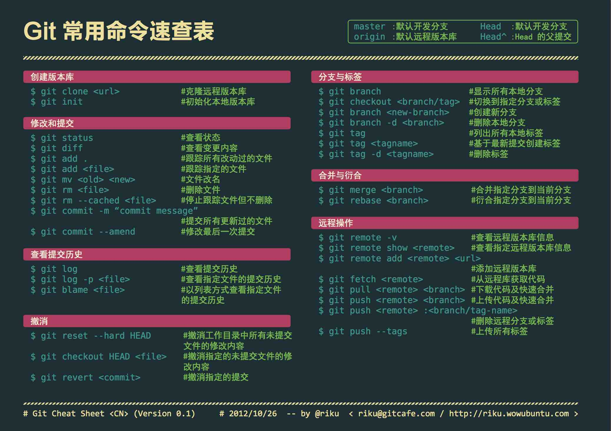

# 版本管理git

## 分支
- git branch # 查看本地分支

- git branch -a # 查看所有分支（包括远程分支）

- git branch -vv # 查看本地分支与远程分支信息

- git checkout -b new-branch #创建并切换至新分支

- git push origin dev:dev # 将本地dev分支推到服务器上，并命名为dev

- git checkout -b develop origin/develop # 切换到远程分支，本地命名为develop

- git reset --hard origin/master # 将本地代码置为某一分支

- git reflog show --date=iso master # 查看分支创建时间

- git push origin --delete patch-3 # 删除分支

- git push origin dev # 将本地dev分支push到远程服务器上

- git fetch --all && git reset --hard origin/develop && git pull # 本地强制获取更新为远程分支

- 分支改名
  1. git branch -m old_branch new_branch # 将本地分支进行改名
  2. git push origin :old_branch # 删除老分支
  3. git push origin new_branch # 将改名后的分支push到远程

## 子项目
> 主项目目录下的.gitmodules文件中包含了submodule的信息  
子项目更新，主项目并不会随之更新，因为主项目指向了当时的子项目的引用

- git submodule add git@submodule.com # 为项目添加子项目

### clone（包含子项目的）项目
- 第一种方式
    1. git clone git@XXX.com # 拉取主项目
    2. git submodule init # 初始化子项目空间
    3. git submodule update # 拉取子项目代码
- 第二种方式
    1. git clone git@XXX.com --recursive # 递归拉取项目代码

## 拉取

- git pull

## 推送
- git push <远程主机名> <本地分支名>:<远程主机分支名> # 将本地修改推送至远程主机

- [本地已有的仓库推送到github](https://sword.studio/142.html)
 1. git remote add origin git@github.com:XXX/XXX.git # 设置本地的origin地址
 2. git push -u origin master

## 合并
- git merge --abort # 取消merge

## 撤销修改
- git checkout fileName # 撤销未add的本地修改

- git reset HEAD fileName # 撤销已add的本地修改

- git reset --hard HEAD^ # 回滚到上一次commit的版本

- git rm --cached fileName # 将暂存区文件删除(如果是文件夹，需要加上 `-rf` 参数)

## 标签tag

- git tag v1.0 # 轻量级tag

- git push origin v1.0 # 推送tag

- git tag -d v1.0 # 删除本地tag

- git push origin :refs/tags/v1.0 # 删除本地tag后，再执行此句删除远端tag

- 回退到某tag
    - git show tag-v1.0 # 找到该tag对应的commit id
    - git reset --hard commit-id # 回退到该版本

## 其他
- git status # 本地工作区状态

- git config --global user.name lsz # 设置提交用户名

- git mv file.txt File.txt # git修改文件名大小写
> 参考：https://www.cnblogs.com/samwang88/p/6611947.html
> git默认大小写不敏感，要修改文件大小写可以使用这种方式


## 恢复已被删除的本地分支

- git reflog --date=iso | grep '关键字' # 找到提交的id

- git branch dev-back 提交id # 那次版本会恢复为dev-back分支

## [配置多个ssh-key](https://www.jianshu.com/p/d6c6f37fb4f1)
1. 假设已有一个ssh-key存在，文件位置：`~\.ssh\id_rsa`
2. ssh-keygen -t rsa -C "你的邮箱@xxx.com" # 生成第二个
> 选择文件保存位置： D:\KIT\ssh-key\id_rsa
3. 进入git安装目录，修改目录下的etc/ssh/ssh_config文件，新增两个Host配置，指定访问哪个git服务器，用哪个文件夹的ssh-key
```conf
Host gitlab.com
    HostName gitlab.com
    User leshizhao
    PreferredAuthentications publickey
    IdentityFile ~/.ssh/id_rsa
	
Host github.com
    HostName github.com
    User leshizhao
    PreferredAuthentications publickey
    IdentityFile D:/KIT/ssh-key/id_rsa
```

# 常见gitignore配置
```conf
# Compiled class file
*.class

# Log file
*.log

# Package Files #
*.jar
*.war
*.nar
*.ear
*.zip
*.tar.gz
*.rar

### Maven template
target/*

# IDEA
.idea/*
*.iml
```